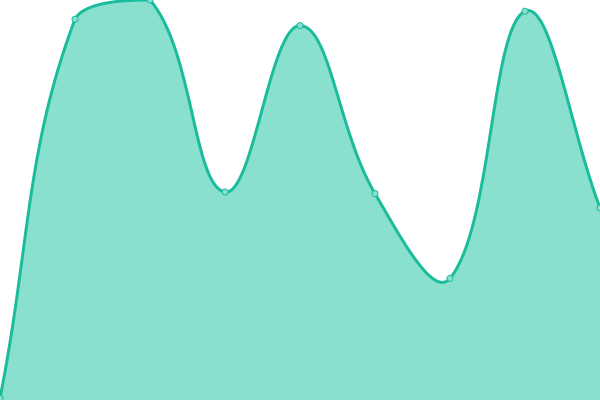
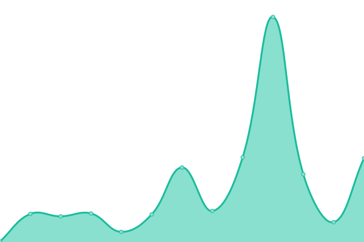

# [📈 Live Status](https://status.mikoradio.com): <!--live status--> **🟥 Complete outage**

This repository contains the open-source uptime monitor and status page for [Miko Radio](https://status.mikoradio.com), powered by [Upptime](https://github.com/upptime/upptime).

With [Upptime](https://upptime.js.org), you can get your own unlimited and free uptime monitor and status page, powered entirely by a GitHub repository. We use [Issues](https://github.com/miko-radio/miko-radio.github.io/issues) as incident reports, [Actions](https://github.com/miko-radio/miko-radio.github.io/actions) as uptime monitors, and [Pages](https://status.mikoradio.com) for the status page.

<!--start: status pages-->
<!-- This summary is generated by Upptime (https://github.com/upptime/upptime) -->
<!-- Do not edit this manually, your changes will be overwritten -->
<!-- prettier-ignore -->
| URL | Status | History | Response Time | Uptime |
| --- | ------ | ------- | ------------- | ------ |
|  [miko](https://mikoradio.com/) | 🟥 Down | [miko.yml](https://github.com/Miko-Radio/miko-radio.github.io/commits/HEAD/history/miko.yml) | 

 173ms
     
 | 

<a href="https://miko-radio.github.io/miko-radio.github.io/history/miko">96.11%</a>
    

|  [Dashboard](http://45.141.24.109) | 🟥 Down | [dashboard.yml](https://github.com/Miko-Radio/miko-radio.github.io/commits/HEAD/history/dashboard.yml) | 

 0ms
     
 | 

<a href="https://miko-radio.github.io/miko-radio.github.io/history/dashboard">0.00%</a>
    

|  [korivash](https://www.korivash.com/) | 🟥 Down | [korivash.yml](https://github.com/Miko-Radio/miko-radio.github.io/commits/HEAD/history/korivash.yml) | 

 144ms
     
 | 

<a href="https://miko-radio.github.io/miko-radio.github.io/history/korivash">94.64%</a>
    

<!--end: status pages-->

[**Visit Miko Status Website →**](https://status.mikoradio.com)

## 📄 License

- Powered by: [Upptime](https://github.com/upptime/upptime)
- Code: [MIT](./LICENSE) © [Anand Chowdhary](https://anandchowdhary.com), supported by [Pabio](https://pabio.com)
- Data in the `./history` directory: [Open Database License](https://opendatacommons.org/licenses/odbl/1-0/)
